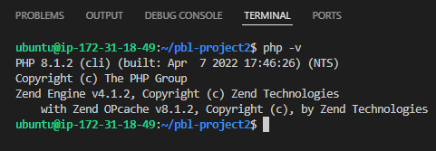

## WEB STACK IMPLEMENTATION (LEMP STACK) IN AWS 

### STEP 1 - IMSTALLING THE NGINX WEB SERVER

 

### STEP 2 - INSTALLING MYSQL

### STEP 3 - INSTALLING PHP

### STEP 4 - CONFIGURING NGINX TO USE PHP PROCESSOR

### STEP 5 - TESTING PHP WITH NGINX

### STEP 6- RETRIEVING DATA FROM MYSQL DATABASE WITH PHP

